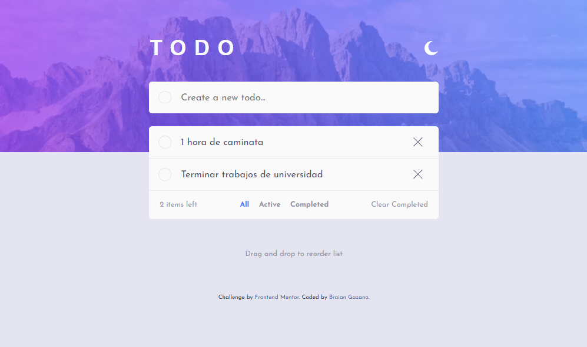
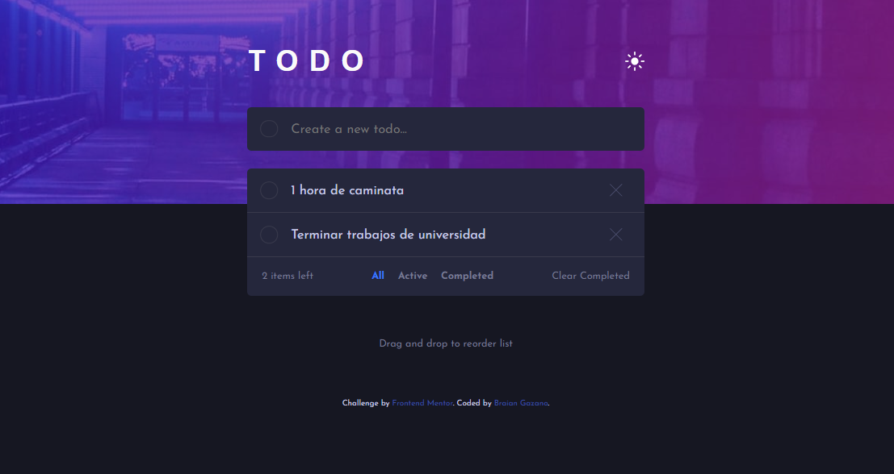
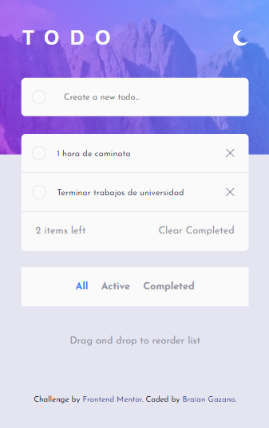
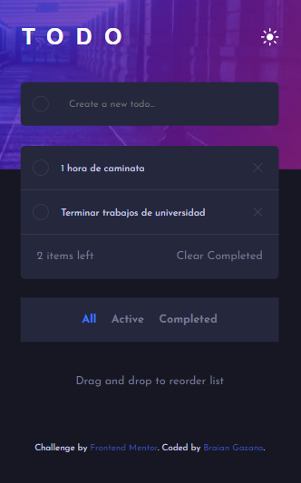

# Frontend Mentor - Todo app solution

Esta es la solución para: [Todo app challenge on Frontend Mentor](https://www.frontendmentor.io/challenges/todo-app-Su1_KokOW).

## Table of contents

- [Overview](#overview)
  - [The challenge](#the-challenge)
  - [Screenshot](#screenshot)
  - [Links](#links)
- [My process](#my-process)
  - [Built with](#built-with)
  - [What I learned](#what-i-learned)
  - [Continued development](#continued-development)
  - [Useful resources](#useful-resources)
- [Author](#author)

## Overview

### The challenge

Los usuarios serán capaces de:

- Ver en una interfaz optima segun el dispositivo que se utilice
- Añadir nuevas tareas a la lista
- Marcar los que se encuentren completos
- Eliminar tareas
- Filtrar segun corresponda
- Eliminar todas las completas
- Intercambiar entre tema claro/oscuro
- **Bonus**: Arrastrar y reorganizar las tareas segun la prioridad

### Screenshot

### Links

- URL Solución: [Todo App Main Frontend Mentor Solution](https://github.com/MohMostafa-Web/todo-app-main-frontend-mentor)
- URL sitio desplegado: [Todo App Main Live Site](https://mohmostafa-web.github.io/todo-app-main-frontend-mentor/)

## My process

### Built with

- HTML5 [header, nav, section]
- CSS [Variables CSS, Media Queries]
- Flexbox
- JS

### What I learned

- El uso de eventos: "dragstart", "dragover", "drop" para reorganizar items en JS.

### Continued development

En el futuro planeo seguir aprendiendo sobre las funcionalidades de drag and drop en JS ademas de empezar proyectos en React

## Author

- Linkedin - [Braian Gazano](https://www.linkedin.com/in/braian-gazano/)
- Github - [Braian Gazano](https://github.com/BraianGazano)
